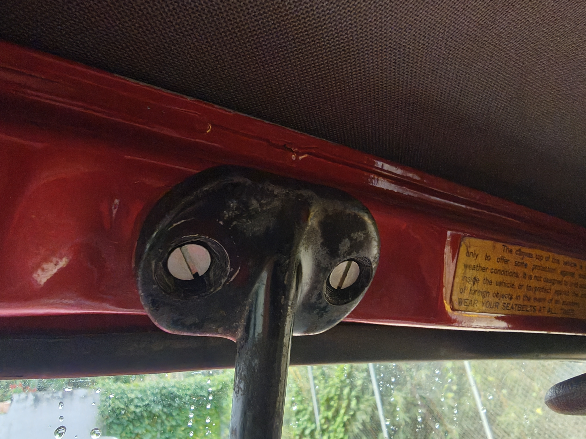
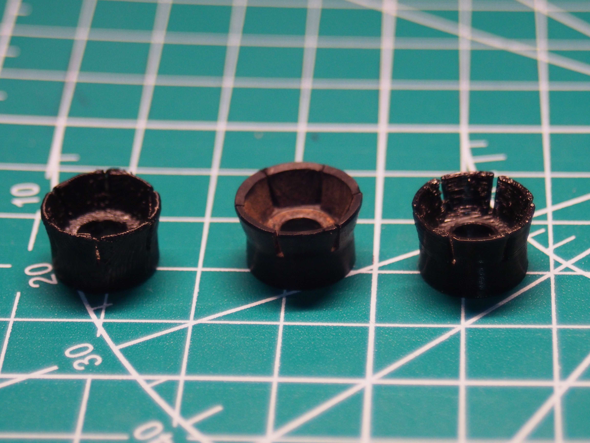
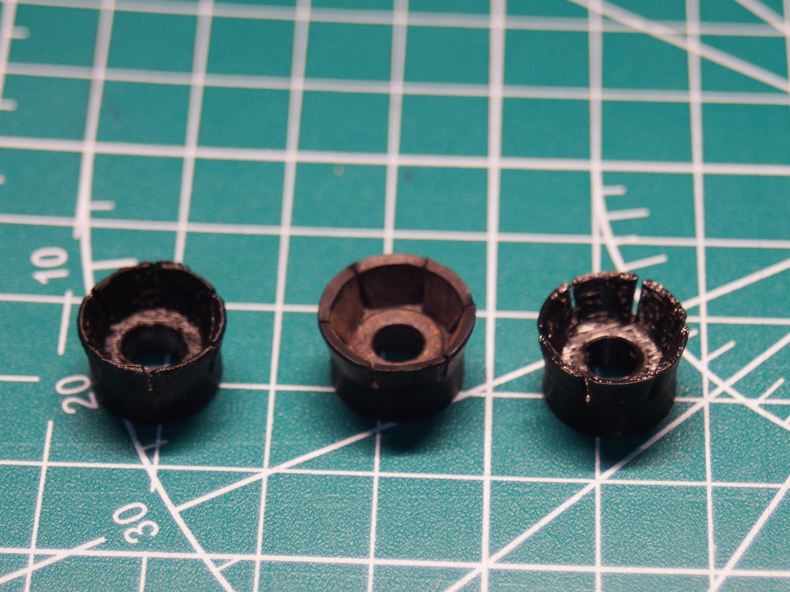

# Suzuki Samurai interior rearview mirror spacer

A direct replacement for the spacer that sits under the screw holding the interior rearview mirror on a 1986 Suzuki Samurai. Same job, same place; print one instead of hunting for a part nobody stocks.

## The part

|  |  |
|---|---|
| Size | 14 x 14 x 8.3 mm |
| Drawn in | FreeCAD 1.0 |
| Fitment | Confirmed on my own 1986 Samurai. If yours is a different market or year, measure first. |

## Printing

|  |  |
|---|---|
| Material | PETG |
| Layer height | slicer default |
| Infill | slicer default |
| Walls | slicer default |
| Orientation | broad side up, or sideways |
| Supports | only if printed sideways |

**Print it in PETG.** This part sits at the top of the windshield, behind glass, in the sun. A closed car in the sun gets far hotter than the air outside, and PLA will go soft there. That is the one choice worth copying.

Everything else can stay at your slicer's defaults. The part is 14 mm across and carries a screw, not a load; it does not need to be clever.

On orientation: I have printed it both broad side up and on its side. Broad side up needs no supports, which is why I would start there. In theory it is the weaker of the two, because the layer lines run across the direction the screw pulls, and layer adhesion is the weak axis in any printed part. In practice I have not tested either to failure, and mine is holding fine. Printing it sideways should give better layer orientation for that load, at the cost of needing supports.

## Fitting

It goes in where the original goes. No trimming, no drilling.

## Files

| File | What it is |
|---|---|
| `mirror-spacer.3mf` | printable; carries its own units, so it lands in your slicer at the right size |
| `mirror-spacer.step` | editable solid, opens in Fusion, SolidWorks, Onshape and the rest |
| `mirror-spacer.FCStd` | FreeCAD source, the original |

If you want to change a dimension, start from the STEP or the FreeCAD file. The 3MF is a mesh: it prints well and edits badly.

There is no STL here on purpose. Every current slicer reads 3MF, and keeping one printable file means there is never a stale copy of this part floating around.

## License and warning

[CC BY-SA 4.0](../../LICENSE). Attribution to Malcolm Davis Steele; keep derivatives under the same license.

No warranty. This one holds a mirror onto a moving vehicle: check your own print before you rely on it.
